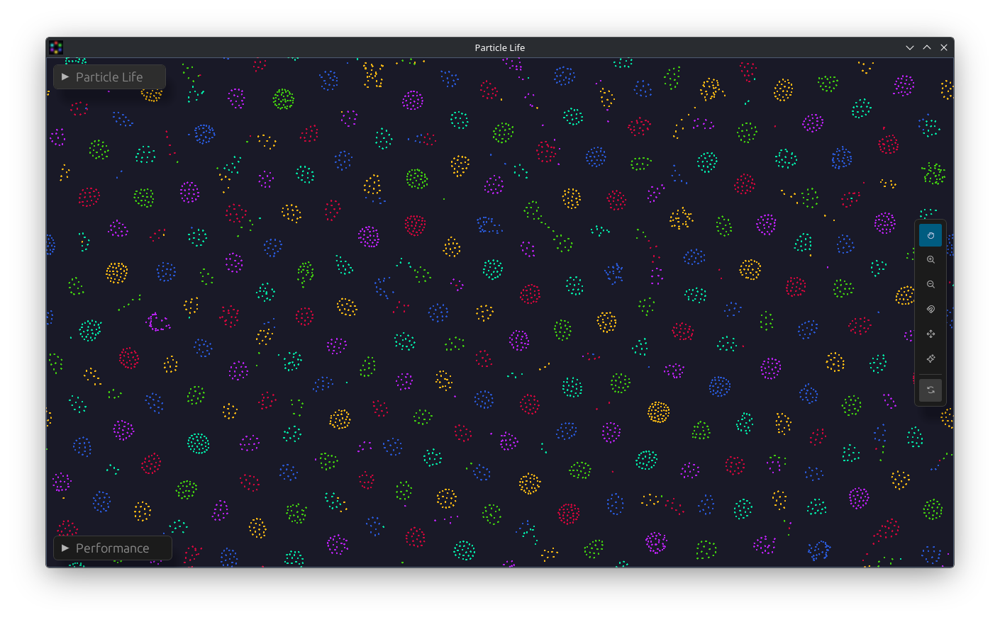
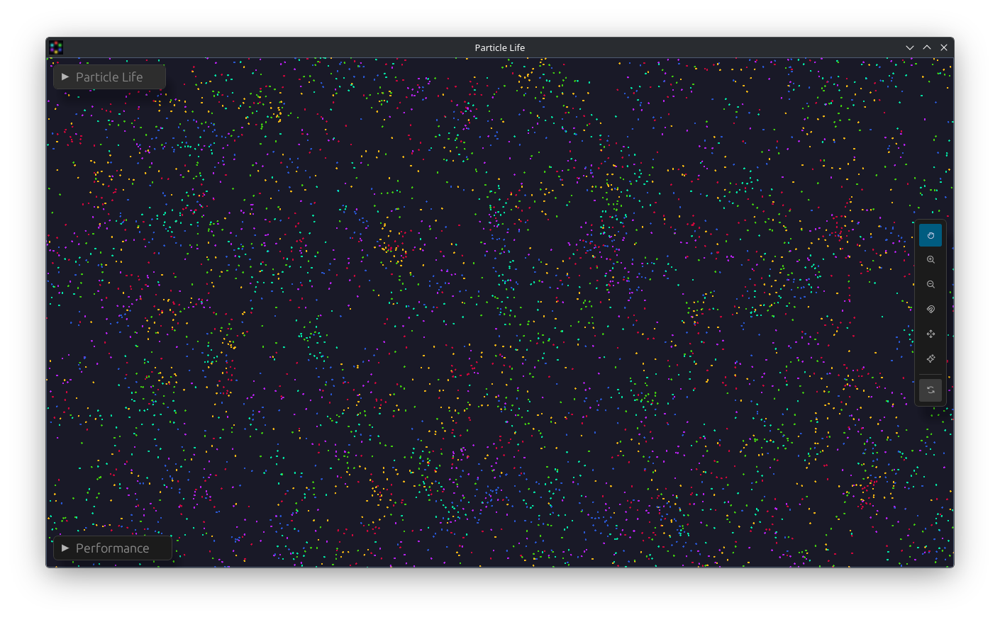
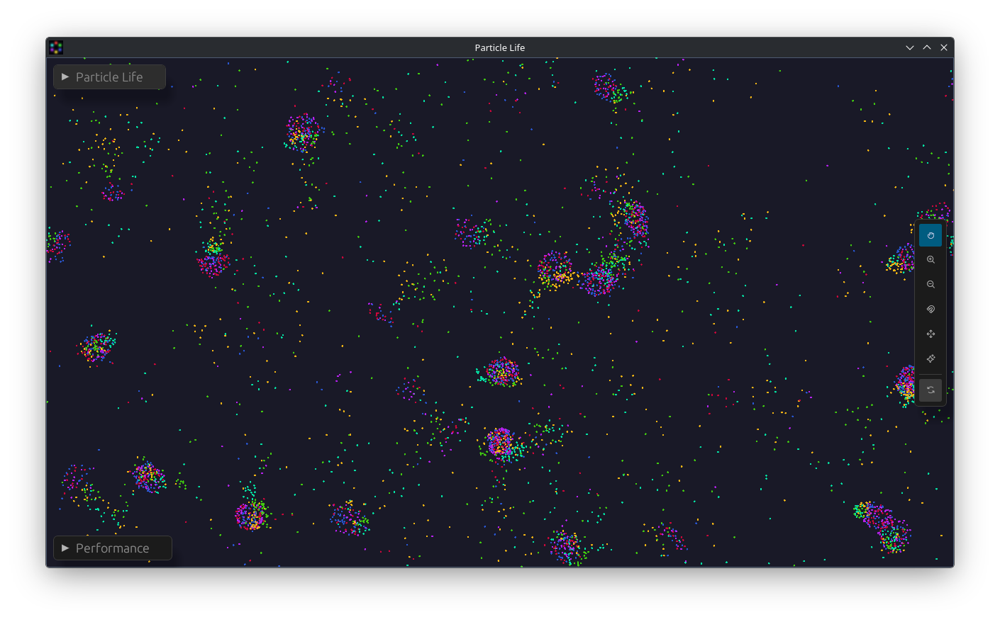
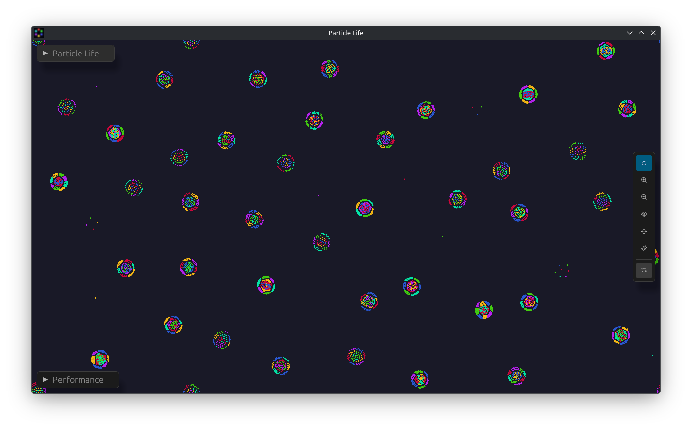

# Particle Life

A GPU-accelerated [Particle Life](https://particle-life.com/) simulator written in Rust. Up to 2,000,000 particles interact via emergent attraction/repulsion rules, running entirely on the GPU at real-time frame rates.

    


## Features

- **100K particles** at 165+ fps on a modern discrete GPU (display-limited; see [Benchmarks](BENCHMARKS.md))
- **500K particles** at 25–59 fps at fixed world size depending on particle distribution (Clusters/Chains ~58 fps; Ecosystem ~25 fps with LDS tile and rsqrt force pass; see [Benchmarks](BENCHMARKS.md)); comparable frame rates at 2M with auto-density
- **16 species** with a fully editable N×N attraction matrix
- **4 border modes:** Wrap (torus), Repel (spring wall), Static (hard wall), Matrix (per-species wall attraction)
- **Interactive tools:** Pan, Zoom, Attract, Repel, Spawn with adjustable range and strength
- **Physical world size** — scales the simulation domain; auto-density mode keeps GPU load linear with particle count by growing the world as particles increase
- **Configurable palette** — five built-in themes (Default, Vivid, Neon, Pastel, Dark), per-species color pickers, and randomize
- **Preset system** — save, load, and import/export TOML presets; four built-in presets included; presets auto-scale to your window on load
- **Matrix share codes** — copy a compact base64 string representing the current attraction matrix and paste it into any other running instance to share emergent behaviors
- **Real-time controls:** particle count, species, physics params, matrix randomization, pause/resume
- **Performance overlay:** FPS, frame time min/max/avg, grid stats, density and neighbour estimate, VSync toggle
- **Capacity benchmark** — binary-search mode finds the maximum sustainable particle count at a configurable target FPS; results exportable as CSV
- **Screenshot capture** — toolbar button saves a PNG to `screenshots/` with a timestamp filename

## Gallery

<table>
  <tr>
    <td align="center"><br><b>Clusters</b> — like attracts like</td>
    <td align="center"><br><b>Chains</b> — predator-prey spirals</td>
  </tr>
  <tr>
    <td align="center"><br><b>Ecosystem</b> — chain hunts a cluster</td>
    <td align="center"><br><b>Symbiosis</b> — cross-species mixing</td>
  </tr>
</table>

## How It Works

### The Force Model

Each pair of particles within range `r_max` interacts via a piecewise force:

- **Repulsion zone** `[0, r_min]`: hard repulsion proportional to overlap — prevents collapse
- **Interaction zone** `[r_min, r_max]`: species-dependent attraction or repulsion, peaking at `(r_min + r_max) / 2`

The attraction coefficient `A[i,j]` ∈ [-1, 1] is stored in a 16×16 matrix. Randomizing the matrix produces qualitatively different emergent behaviors: orbiting clusters, chain structures, single-species stars, and more.

### GPU Pipeline (6 compute passes per frame)

All physics runs on the GPU via [wgpu](https://github.com/gfx-rs/wgpu) compute shaders (WGSL). A spatial grid reduces the force pass from O(N²) to O(N · k) where k is average neighbors per cell.

| Pass | Shader | Work |
|------|--------|------|
| 1. Count | `grid_count.wgsl` | Each particle atomically increments its cell's counter |
| 2. Prefix A | `grid_prefix_a.wgsl` | 256-thread Blelloch block scan; writes block totals; zeros counts for scatter reuse |
| 3. Prefix B | `grid_prefix_b.wgsl` | Serial scan of ≤1,173 block totals (vs up to 300,000 in a naive approach) |
| 4. Prefix C | `grid_prefix_c.wgsl` | Propagates block offsets to produce final per-cell offsets |
| 5. Scatter | `grid_scatter.wgsl` | Claims a sorted slot via `atomicAdd`; writes `{position, species, index}` directly (reorder merged) |
| 6. Force | `compute.wgsl` | 21-cell neighborhood; cooperative LDS tile for dense workgroups; `inverseSqrt`-based force |

`sorted_entries` is written in cell-sorted order, converting per-neighbor random reads in the force loop into sequential memory access. In clustering scenarios the force pass uses workgroup-shared LDS tiles to amortise global reads across all 64 threads in a workgroup.

**Grid parameters:** cell size = `r_max_norm / 2`, so `grid_w = max(5, floor(2 / r_max_norm))`. The effective `r_max_norm = r_max × 720 / world_height` shrinks as the world grows, producing a finer grid with fewer neighbours per particle. At default settings (r_max=0.08, world_height=720): 25×25 = 625 cells, ~80 particles/cell at 50K. At 500K with auto-density: ~250×250 = 62,500 cells, ~8 particles/cell — same GPU cost per particle.

### Rendering

Particles are rendered as instanced soft circles via a vertex+fragment shader (`particle.wgsl`). Each particle is a 2-triangle quad; the fragment shader discards pixels outside the unit circle and applies a smoothstep alpha for a soft edge. The particle buffer is shared between the compute and render pipelines (no CPU readback).

A camera transform supports pan and zoom; the UI overlay is rendered via [egui](https://github.com/emilk/egui).

## Building

```sh
# Requires Rust (edition 2024) and a Vulkan-capable GPU
cargo build --release
cargo run --release
```

The Vulkan backend is required. Wayland and X11 are both supported via winit.

## Dependencies

| Crate                                | Version | Purpose                                      |
|--------------------------------------|---------|----------------------------------------------|
| `wgpu`                               | 24      | GPU compute + rendering (Vulkan backend)     |
| `winit`                              | 0.30    | Window management (`ApplicationHandler` API) |
| `egui` + `egui-winit` + `egui-wgpu`  | 0.31    | Immediate-mode UI overlay                    |
| `egui-phosphor`                      | 0.9     | Phosphor icon font for the toolbar (MIT)     |
| `bytemuck`                           | 1       | Safe Pod casts for GPU buffer uploads        |
| `pollster`                           | 0.3     | Block on async wgpu initialization           |
| `serde` + `toml`                     | 1 / 0.8 | Preset serialisation                         |
| `base64`                             | 0.22    | Matrix share-code encoding                   |
| `clap`                               | 4       | Command-line argument parsing (MIT / Apache-2.0) |
| `rfd`                                | 0.15    | Native file dialogs for import/export        |
| `png`                                | 0.17    | PNG encoding for screenshots and thumbnails  |
| `log` + `env_logger`                 | 0.4 / 0.11 | Structured logging (adapter selection, warnings) |

## Command-Line Options

```
Usage: ParticleLife [OPTIONS]

Options:
      --bench                      Run full benchmark suite and write CSV, then exit
      --capacity-bench             Run capacity benchmark and write CSV, then exit
      --bench-output <FILE>        CSV output path (default: bench_results.csv / capacity_results.csv)
      --preset <NAME_OR_INDEX>     Apply preset on launch (name or 0-based index)
      --fullscreen                 Open in borderless fullscreen on launch
      --world-size <WxH>           Set world size, e.g. 1920x1080
      --particles <N>              Set particle count (clamped to 100–2 000 000)
      --matrix <CODE>              Apply attraction matrix share code on launch
  -h, --help                       Print help
```

All flags are optional and compose freely. When `--preset` and individual overrides (`--world-size`, `--particles`, `--matrix`) are combined, the preset is applied first and the overrides take precedence. Benchmark flags (`--bench`, `--capacity-bench`) ignore most sim settings because the benchmark runner cycles through its own fixed preset+tier combinations.

## Controls

### Mouse

| Action | Effect |
|--------|--------|
| **Drag** (Pan tool) | Pan the camera |
| **Middle-click drag** | Pan the camera (any tool) |
| **Scroll wheel** | Zoom in/out centered on cursor |
| **Click** (Zoom +/−) | Zoom in/out centered on cursor |
| **Hold click** (Attract/Repel) | Pull/push particles toward cursor |
| **Hold click** (Spawn) | Emit new particles at cursor |

### Toolbar

| Button | Effect |
|--------|--------|
| Pan / Zoom +/− / Attract / Repel / Spawn | Switch active tool |
| Reset View | Fit world to window |
| Camera icon | Save a PNG screenshot to `screenshots/` |

### Keyboard

| Key | Effect |
|-----|--------|
| `Arrow keys` | Pan |
| `+` / `=` | Zoom in |
| `-` | Zoom out |
| `Space` | Pause / resume simulation |
| `0` | Reset view |
| `R` | Respawn particles |
| `S` | Save screenshot to `screenshots/` |
| `F11` | Toggle fullscreen |
| `Escape` | Quit |

## Project Structure

```
src/
  main.rs              — Entry point; parses CLI args, creates EventLoop + ControlFlow::Poll
  cli.rs               — CLI argument definitions (clap derive)
  app.rs               — ApplicationHandler; owns window, renderer, sim, egui state, camera
  renderer.rs          — wgpu device/surface/pipeline; render() drives one frame
  simulation.rs        — SimulationState; GPU buffers, 6-pass dispatch, spawn, preset apply
  benchmark.rs         — QuickBench (ad-hoc), BenchmarkRunner (full suite + CSV export), CapacityBench (max-particle binary search at target FPS)
  config.rs            — Preset struct, built-in presets, TOML save/load, session persistence
  ui.rs                — egui panels: toolbar, params, attraction matrix, perf overlay
  shaders/
    particle.wgsl      — Instanced soft-circle vertex + fragment shader
    compute.wgsl       — Force integration (pass 6)
    grid_count.wgsl    — Spatial grid pass 1
    grid_prefix_a.wgsl — Spatial grid pass 2 (Blelloch block scan)
    grid_prefix_b.wgsl — Spatial grid pass 3 (block-sum scan)
    grid_prefix_c.wgsl — Spatial grid pass 4 (offset propagation)
    grid_scatter.wgsl  — Spatial grid pass 5 (scatter + reorder merged)
```

## Default Parameters

| Parameter | Value | Description |
|-----------|-------|-------------|
| `r_min` | 0.025 | Hard-core repulsion radius (fraction of reference world height 720) |
| `r_max` | 0.08 | Interaction cutoff (fraction of reference world height 720); effective GPU radius scales with world size |
| `friction` | 0.5 | Velocity half-life ~1.4s |
| `force_scale` | 0.007 | Global force multiplier |
| `particle_radius` | 1.5 | Rendered size in world units |
| `world_width/height` | 1280 × 720 | Simulation world dimensions; affects interaction density |
| Max particles | 2,000,000 | Hard GPU buffer limit (~90 MB VRAM) |
| Max species | 16 | Attraction matrix dimension |

## AI Assistance

This project was developed with the help of [Claude Code](https://claude.ai/code) (Anthropic). AI assistance was used throughout: architecture decisions, GPU pipeline implementation, UI, benchmarking, documentation, and code review.

## Contributing

Contributions are welcome! Before your first pull request, please read the
[Contributor License Agreement](CONTRIBUTORS.md). The CLA Assistant bot will
prompt you to sign when you open a PR.

## License

MIT — see [LICENSE](LICENSE).
